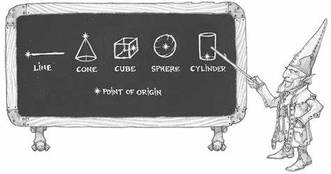

### Area of Effect
[Home](dm-operations-center) > [Spellcasting](spellcasting-menu) > Area of Effect {.small-text}

{.caption .text-center}

    <a href="cone">Cone</a>
    <a href="cube">Cube</a>
    <a href="cylinder">Cylinder</a>
    <a href="line">Line</a>
    <a href="sphere">Sphere</a>

